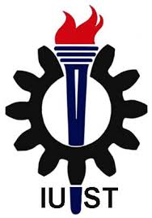

- Here is an article about my university called -IUST-
# Iran University of Science and Technology

Iran University of Science and Technology (IUST) (Persian: دانشگاه علم و صنعت ایران, Dâneshgâh-e 'elm va San'at-e Irân) is a research institution and university of engineering and science in Iran. The university is home to 15 faculties offering undergraduate and postgraduate degrees in a wide range of engineering-based subjects as well as maths, physics, and department of foreign languages. In 1995 IUST awarded Iran’s first PhDs in materials, metallurgical and traffic engineering. IUST is the only university in the Middle East which has a school of railway engineering and a school of progress engineering. It is also the only university in Iran which has a school of automotive engineering. There are also 12 research centres, nine centres of excellence and 19 specialised libraries as well as four satellite campuses in other parts of the country.[6] IUST is located on Hengam Street in the Narmak neighborhood in northeast Tehran.

The 20,000[7] capacity IUST Stadium, which is used mostly for association football, is their main sports venue.
History

Iran University of Science and Technology was founded in 1929 as the first Iranian Institution to train engineers, named the Governmental Technical Institute. Soon it was named "Honarsarā-ye Ālī" (Persian: Persian: هنرسرای عالی; Advanced Art College in English). In 1932, the first Iranian graduated in Machine Engineering and in 1935 the first Iranian graduated in Chemical Engineering. In 1958, the Institute started to enroll students for Masters programs under the name of Tehran Institute of Technology (TIT). In 1963, the Institute transferred to its current location in Narmak in northeast Tehran. In 1972, the title of the college upgraded to the Iran Faculty of Science and Technology due to the growth of the institute by the Ministry of Sciences. The faculty offered four-year bachelor's degrees in most areas of engineering and it is the first and for many years the only engineering university that consist of School of Architecture in the country.

In 1978, it was granted University Status by the Ministry of Sciences. Since then the institute was named Iran University of Science and Technology.

In 1990 it admitted students to Ph.D. programs in Civil Engineering and Materials Engineering fields. In 1995, IUST awarded the first Ph.D. degrees in Iran in the fields of Materials Engineering, Metallurgical Engineering and Traffic Engineering.

The main campus has 15 faculties and three other departments with 380 members of the academic board. On the main campus, 9,000 students are studying in 90 fields of engineering and sciences, out of which 2,000 are M.Sc. and 546 are Ph.D. students. Over 50,000 students have graduated since 1932. 

